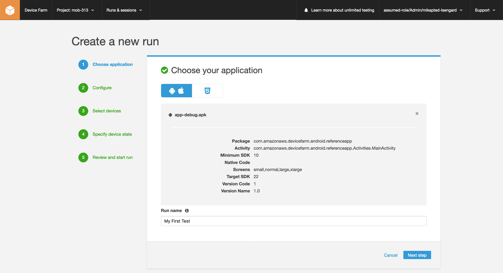
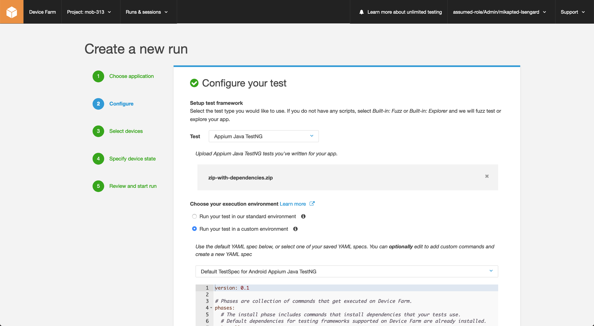
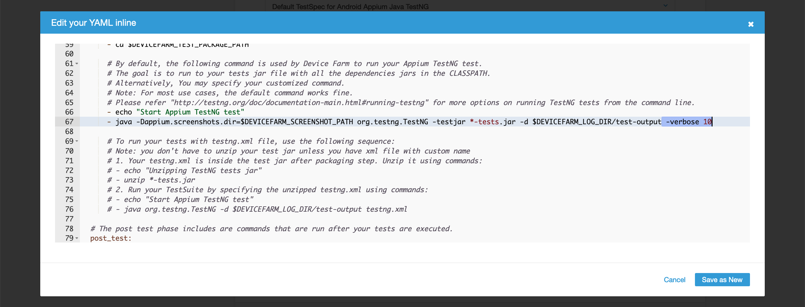

[Back to main guide](../README.md) 

[Previous](device-farm.md) | [Next](code-pipeline-test-built-in.md)

#### Create and launch a test run in the AWS console

1. Click **Create a new run**

2. Under **Choose application**:
  - For application type, specify `Test a native application on Android or iOS devices`
  - Click **Upload**, choose the `app-debug.apk` you downloaded in the last step
  - For **Run name**, specify `My First Test`
  - Click **Next step**

3. Under **Configure**:
  - For **Test**, specify `Appium Java TestNG`
  - Click **Upload**, choose the `zip-with-dependencies.zip` you downloaded in the last step
  - For **Choose your execution environment**, choose `Run your test in a custom environment`
  - Ensure `Default TestSpec for Android Appium Java TestNG` is selected

  - Scroll down and click **Edit** under the test spec box
  - Scroll down in the edit box to line 67 and remove the `--verbose 10` from the test output
  - Click **Save as New**

  - For the file name, specify `mob-313`
  - Click **Save**

4. Under **Select devices**:
  - Click **Create a new device pool**
  - Explore the device list by changing Platform, OS Version, Form Factor and Status
  - Click **Cancel**
  - Accept the defaults (Top Devices)
  - Click **Next step**

5. Under **Specify device state**:
  - Explore the options like radio states, device location and device locale
  - Accept the defaults
  - Click **Next step**

6. Under **Review and start run**:
  - For **Maximum minutes per device**, specify `30`
  - Click **Confirm and start run**

7. Click on **My First Run** to view progress

8. Click on a device to watch the tests run live and see test run output

  [Previous](device-farm.md) | [Next](code-pipeline-test-built-in.md)